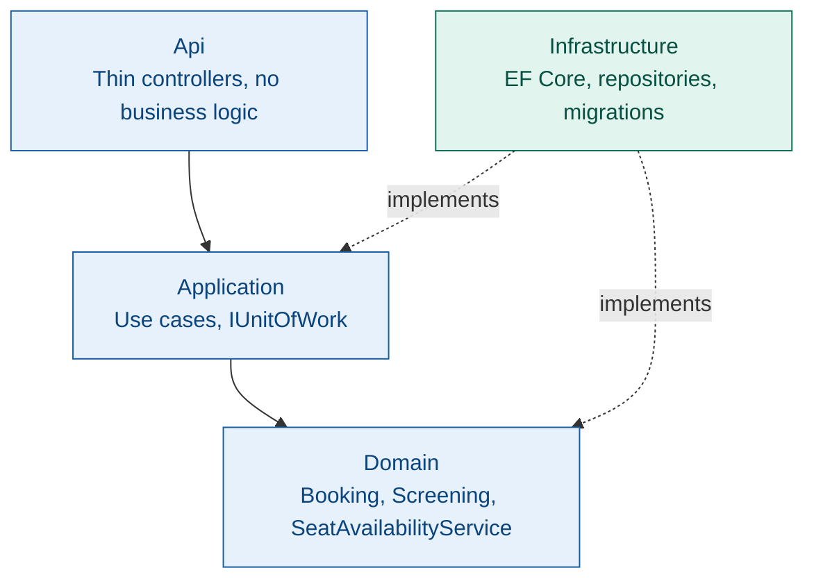

<div align="center">

# Event Seat Booking

**A Domain-Driven Design reference implementation — seat reservation modeled as aggregates that enforce their own consistency, not a service layer bolting rules onto anemic data.**


</div>

---

## Overview

Two customers can't book the same seat. A booking can't exceed six seats. A cancelled booking can't be confirmed, but a confirmed one can be cancelled. None of these rules live in a service checking `if` statements before calling a repository — they live inside the entities responsible for them, enforced through methods, not exposed through public setters.

This project demonstrates that discipline end-to-end: two aggregate roots, a domain service coordinating the one rule that spans both, domain events raised only on success, and a thin Application + Infrastructure + API layer proving the model works against a real database, not just in memory.

---

## Architecture



- **Domain** — zero dependencies on anything else. No EF Core, no HTTP, nothing but C# and the business rules themselves.
- **Application** — orchestrates use cases: load aggregates, call domain methods, commit once via `IUnitOfWork`.
- **Infrastructure** — implements the interfaces Domain and Application define. Owns EF Core, SQL Server, and the migrations.
- **Api** — three endpoints, each a direct call into a use case. If a controller ever needs an `if` statement to enforce a rule, that rule belongs in Domain instead.

---

## Aggregates

### `Booking`

Owns a collection of `BookedSeat`. Enforces:

- Maximum 6 seats per booking
- No duplicate seat within the same booking
- Seats can only be added while the booking is `Pending`
- A booking with zero seats cannot be confirmed
- A cancelled booking cannot be confirmed; a confirmed booking can still be cancelled

Constructed only through `Booking.Create(...)` — a private constructor and private setters mean there is no path to an invalid `Booking`.

### `Screening`

Owns the seat map for a single showing — title, showtime, and each seat's status (`Available` / `Reserved` / `Booked`). Kept as a separate aggregate from `Booking` deliberately: many bookings reference one screening, and a screening's own lifecycle doesn't need to change atomically with any individual booking.

### The cross-aggregate problem

Neither aggregate can answer "is this seat actually free" alone — `Booking` only sees its own seats, `Screening` owns availability but not the booking decision. `SeatAvailabilityService`, a Domain Service, resolves this: it asks `Screening` to reserve the seat first, and only adds it to `Booking` if that succeeds. A rejected reservation never touches `Booking`, so the two aggregates never drift out of sync.

Full reasoning — including the alternatives considered and why they were rejected — is in [`docs/domain-model.md`](docs/domain-model.md).

### Domain Events

`SeatAddedEvent`, `BookingConfirmedEvent`, `BookingCancelledEvent` — immutable records, raised from inside `Booking` only on success. A rejected operation (seat limit exceeded, confirming an empty booking) raises nothing. Collected on the aggregate, cleared via `ClearDomainEvents()` once consumed.

---

## API

| Method | Endpoint | Description |
|---|---|---|
| POST | `/api/screenings/{screeningId}/reserve-seat` | Coordinates `Screening` + `Booking` via `SeatAvailabilityService`; creates a new booking |
| POST | `/api/bookings/{bookingId}/confirm` | Confirms a pending booking with at least one seat |
| POST | `/api/bookings/{bookingId}/cancel` | Cancels a booking and releases its seats back to `Available` on the screening |

**Example:**

```
POST /api/screenings/1/reserve-seat
{
  "customerId": 1,
  "seatRow": "A",
  "seatColumnNumber": 1
}
```

A second identical request against the same seat returns `400 Bad Request` — proof the invariant holds through the full stack, not just in a unit test.

---

## Testing

29 unit tests against the domain layer directly — no mocking, no infrastructure. Coverage includes boundary conditions (exactly 6 seats succeeds, a 7th is rejected), negative cases (a failed operation raises no domain event), and the cross-aggregate case: a second reservation attempt on an already-reserved seat is rejected by `Screening` before it ever reaches `Booking`.

---

## Running it locally

```bash
git clone https://github.com/Ommmarr111/EventSeatBooking.git
cd EventSeatBooking
dotnet ef database update --project EventSeatBooking.Infrastructure --startup-project EventSeatBooking.Api
dotnet run --project EventSeatBooking.Api --launch-profile http
```

Set `ConnectionStrings:DefaultConnection` in `EventSeatBooking.Api/appsettings.json` to a local SQL Server instance.

Swagger: `http://localhost:5134/swagger`

The database starts empty — seed a `Screening` and its `Seat` rows directly before exercising the API; there's deliberately no admin endpoint for this, since creating screenings isn't part of what this project demonstrates.

---

## Project structure

```
EventSeatBooking.Domain/          # Entities, Value Objects, Domain Services, Domain Events, repository interfaces
EventSeatBooking.Domain.Tests/    # 29 unit tests against the domain layer only
EventSeatBooking.Application/     # Use cases, IUnitOfWork
EventSeatBooking.Infrastructure/  # EF Core DbContext, entity configurations, repositories, migrations
EventSeatBooking.Api/             # Controllers, DI wiring
docs/domain-model.md              # Design rationale: aggregate boundaries, the Domain Service, concurrency approach
```

---

<div align="center">

**[LinkedIn](https://linkedin.com/in/Ommmarr111) · [GitHub](https://github.com/Ommmarr111)**

</div>
